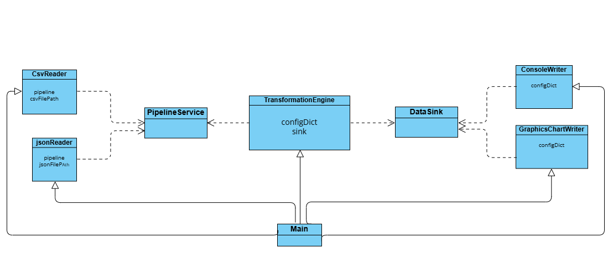
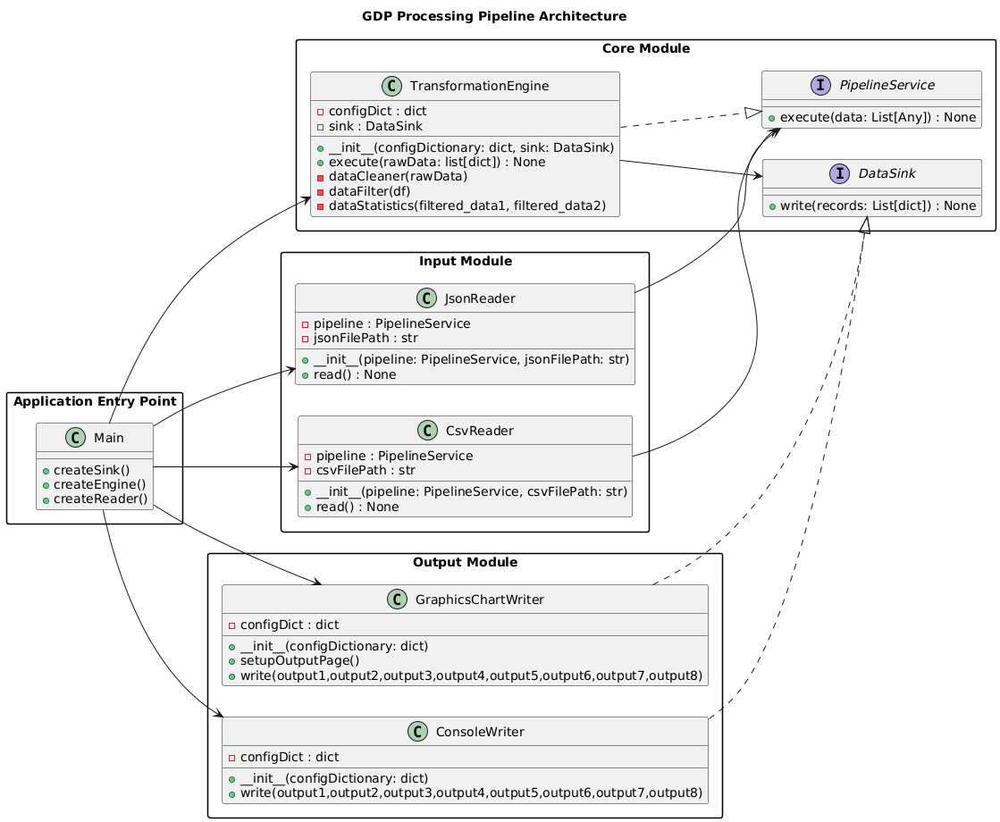

# Modular Orchestration & Dependency Inversion | Python Project

Transition from a script-based approach to a **modular architecture** using **Dependency Inversion Principle (DIP)**.  
This project decouples the system so that the **Core module** remains agnostic of data persistence and ingestion details.

---

## 📌 Table of Contents

- <a href="#overview">Overview</a>
- <a href="#architecture">Architecture</a>
- <a href="#features">Features</a>
- <a href="#folder-structure">Folder Structure</a>
- <a href="#requirements">Requirements</a>
- <a href="#how-to-run">How to Run</a>
- <a href="#uml-diagram">Class Diagram & UML</a>
- <a href="#author-contact">Author & Contact</a>

---

<h2><a class="anchor" id="overview"></a>Overview</h2>

This project refactors a data-processing application into a **fully modular architecture**.  
The system consists of four main modules:

- **Main Module (Orchestrator)**: Entry point, loads config, performs dependency injection, and wires components.
- **Core Module (Domain)**: Defines business logic and Protocols for inputs and outputs.
- **Input Module (Source)**: Implements data ingestion (CSV, JSON, etc.) using the Core’s protocols.
- **Output Module (Sink)**: Implements data output (console, file, chart) according to Core’s DataSink protocol.

The architecture ensures **decoupling**, **modularity**, and **flexibility**, allowing you to swap inputs/outputs without modifying Core logic.

---

<h2><a class="anchor" id="architecture"></a>Architecture</h2>

- Follows the **Dependency Inversion Principle (DIP)**  
- Core defines **Protocols** for Input (`PipelineService`) and Output (`DataSink`)  
- Main module injects dependencies at runtime via a **Factory/Registry**  
- Input/Output modules interact with Core using only the defined Protocols  

> Diagram and visual explanation provided in the **Class Diagram & UML** section.

---

<h2><a class="anchor" id="features"></a>Features</h2>

### ⚙ Modularity & Dependency Inversion
- Core is agnostic to data sources and sinks
- Input and Output modules can be swapped easily
- Structural typing via Python `typing.Protocol`

### 📊 Supported Outputs
- Top/Bottom 10 Countries by GDP
- GDP Growth Rate per country
- Average GDP by continent
- Global GDP trends
- Fastest growing continents
- Countries with consistent GDP decline
- Contribution of each continent to global GDP

### 🔌 Plug-and-Play Design
- Add new CSV/JSON readers or console/file/chart writers without touching Core
- Flexible configuration via `config.json`

---

<h2><a class="anchor" id="folder-structure"></a>Folder Structure</h2>

```

project_root/
├── main.py             # Entry point / Orchestrator
├── config.json         # Configuration file (switch IO modules)
├── core/
│   ├── **init**.py
│   ├── contracts.py    # Protocol definitions (DataSink, PipelineService)
│   └── engine.py       # Core Engine & business logic
├── plugins/
│   ├── **init**.py
│   ├── inputs.py       # CSVReader, JSONReader implementations
│   └── outputs.py      # ConsoleWriter, FileWriter, GraphicsChartWriter
├── data/               # Sample datasets
├── architecture.puml   # PlantUML source code for class/module diagram
└── README.md           # Project documentation

```
---

<h2><a class="anchor" id="requirements"></a>Requirements</h2>

- **Python 3.10+**  
- **Standard Library Modules**: `typing`, `abc`, `json`, `importlib` (optional)  
- `matplotlib` or other charting libraries for GraphicsChartWriter

---

<h2><a class="anchor" id="how-to-run"></a>How to Run</h2>

1. Clone the repository:

```bash
git clone https://github.com/Laiba-Atiq/Functional-GDP-Analysis-Python.git
````

2. Navigate to the project folder:

```bash
cd project_root
```

3. Run the main orchestrator:

```bash
python main.py
```

4. The program will process data according to `config.json` and generate outputs in the chosen sinks.

---

<h2><a class="anchor" id="uml-diagram"></a>Class Diagram & UML</h2>

You can find the full PlantUML file here: [`architecture.puml`](architecture.puml)

### Class Diagram


### Graphical Representation


---

<h2><a class="anchor" id="author-contact"></a>Author & Contact</h2>

**Laiba Atiq**

* GitHub: [github](https://github.com/Laiba-Atiq)
* Email: [email](laibatiq@gmail.com)

**Mina Qayyum**

* GitHub: [github](https://github.com/minaqayyum)
* Email: [email](minaqayyum06@gmail.com)

